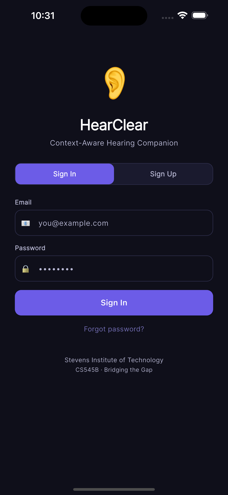

# SPECTRA

**Sound Processing Engine for Context-aware, Trainable, Real-time Alerts**

SPECTRA is an advanced open-source audio intelligence framework designed to provide context-aware sound recognition and assistive alerting. By combining real-time digital signal processing with interactive machine learning (IML), SPECTRA transforms environmental sounds into actionable insights for users who require enhanced auditory awareness.



## 🚀 Overview

The project bridges the gap between raw audio data and human context. Unlike standard sound classifiers, SPECTRA evaluates sound events based on the user's specific environment, time of day, and personal preferences, ensuring that alerts are both relevant and non-intrusive.

### Core Pillars
*   **Context-Awareness**: Intelligent filtering that distinguishes between a doorbell at home and a buzzer in a noisy office.
*   **Interactive ML (IML)**: A human-in-the-loop system allowing users to refine and train the model on-the-fly for their specific acoustic environments.
*   **Real-Time Performance**: Optimized for low-latency sound event detection (SED) and live visualization.
*   **Accessibility-First**: Designed with glassmorphic UI principles to provide high-visibility feedback and intuitive navigation.

## ✨ Key Features

### 1. Adaptive Sound Alerts
Detects over 15+ environmental sound categories (Fire Alarms, Doorbells, Appliances, etc.) and delivers prioritized notifications based on context rules.

### 2. Interactive Feedback Loop
Users can provide instantaneous "Correct/Incorrect" feedback on classifications. This data feeds back into the backend to retrain and fine-tune models for personalized accuracy.

### 3. Environment Programming
Switch between different "Hearing Programs" (e.g., *Outdoor*, *Meeting*, *Home*, *Restaurant*) that adjust sensitivity and focus based on the acoustic profile of the surroundings.

### 4. Real-time Transcription
Integrated speech-to-text engine for live captioning of conversations, optimized for accessibility and noisy environments.

### 5. Waveform Visualization
Live visual feedback of ambient sound intensity and frequency, helping users "see" their soundscape.

## 🛠 Tech Stack

*   **Frontend**: [Flutter](https://flutter.dev) (Dart) - Cross-platform mobile architecture.
*   **State Management**: Provider - Scalable and reactive data flow.
*   **Audio Engine**: Advanced DSP for real-time waveform rendering.
*   **Backend Integration**: REST API & WebSockets for real-time alert streaming and ML training.
*   **ML Ready**: Designed for TFLite integration for on-device inference.

## 📦 Getting Started

### Prerequisites
*   Flutter SDK (v3.10.0 or higher)
*   Dart SDK (v3.0.0 or higher)
*   Android Studio / Xcode (for mobile builds)

### Installation
1.  Clone the repository:
    ```bash
    git clone https://github.com/siddhant-rajhans/SPECTRA.git
    cd SPECTRA
    ```

2.  Install dependencies:
    ```bash
    flutter pub get
    ```

3.  Run the application:
    ```bash
    flutter run
    ```

> [!NOTE]
> The app currently initializes with a mock data service for demonstration purposes. Refer to the [INTEGRATION_GUIDE.md](INTEGRATION_GUIDE.md) to connect to a live backend.

## 🤝 Contributing

We welcome contributions from the community! Whether you're interested in refining the ML models, improving the audio processing logic, or enhancing the UI, please feel free to open an issue or submit a pull request.

## 📜 License

This project is licensed under the MIT License - see the [LICENSE](LICENSE) file for details.

---

*Transforming sound into clarity.*
