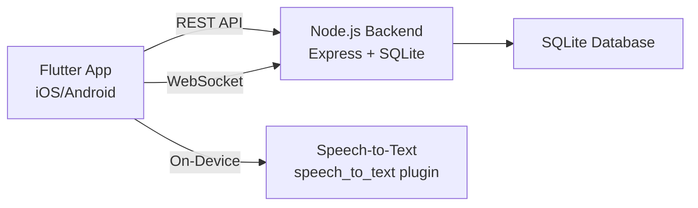

# HearClear Production-Ready Implementation Plan

## Overview
Make HearClear production-ready for real-world testing with a cochlear hearing aid user. This involves:
1. **Move the existing Node.js backend** from `HearClear 3/server/` into `backend/`
2. **Wire the Flutter frontend** to the real backend API (replace all mock data)
3. **Add real speech-to-text** for the Transcription screen
4. **Ensure the app works on a physical device** connecting to the backend over LAN

## Architecture

## Phase 1: Backend Setup
- Copy `HearClear 3/server/` → `backend/server/`
- Copy `HearClear 3/package.json` → `backend/package.json`
- Verify `npm install` and `npm start` work
- Add CORS for physical device access (wildcard or LAN IP)

## Phase 2: Frontend API Client
- Create `lib/services/api_client.dart` — HTTP + WebSocket client
- Add `http` and `web_socket_channel` to `pubspec.yaml`
- Add `fromJson` / `toJson` to all models

## Phase 3: Replace Mock Data
- Rewrite `AppProvider` to call real API endpoints
- Wire auth → `/api/auth/login`
- Wire alerts → `/api/alerts`
- Wire IML → `/api/iml/*`
- Wire environment → `/api/environment/*`
- Wire profile → `/api/profile`
- Wire transcription → real `speech_to_text` plugin + `/api/transcribe/*`

## Phase 4: Real-time Features
- WebSocket for push alerts
- Live speech-to-text using `speech_to_text` package

## Phase 5: Polish & Test
- Error handling and loading states
- Test on physical device with backend on LAN
